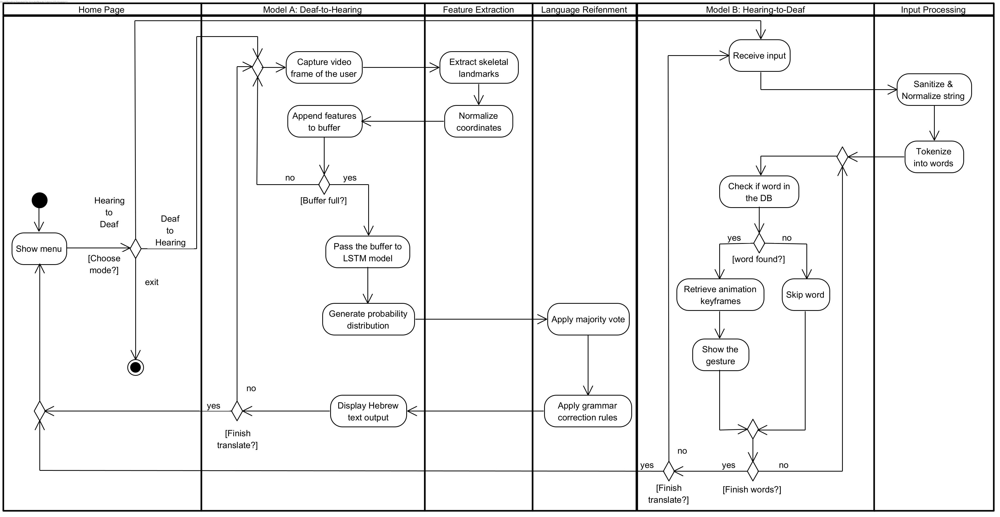
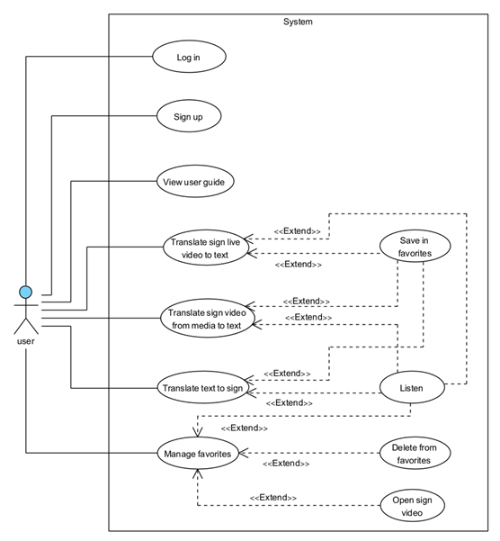
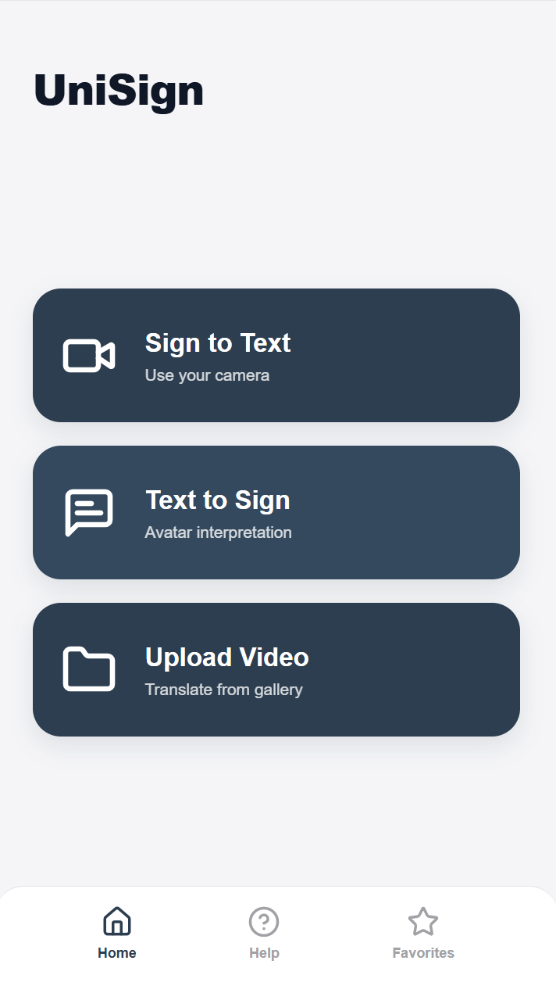
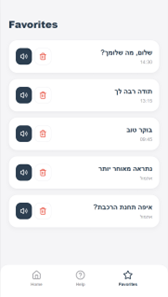
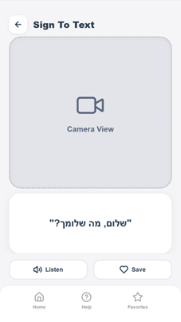
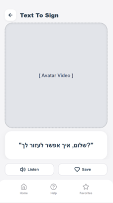

# UniSign - System Documentation & Design Assets

**A Bi-Directional Israeli Sign Language (ISL) Translator Application.**

This repository contains the official documentation, design diagrams, and visual assets for the **UniSign** Android application. UniSign is designed to bridge the communication gap between the Deaf community and Hebrew speakers using real-time, offline AI.

---

## Repository Contents

This repository is organized into the following sections:

* **[book](./Project-Book)**: The complete Final Project (Phase A) research paper.
* **[Diagram](./Diagrams)**: System architecture, flow charts, and UML diagrams.
* **[GUI](./GUI)**: Application screenshots and interface mockups.

---

## System Architecture

UniSign operates as a **closed-loop system** running entirely on the user's device (Edge AI). The architecture is divided into three core modules:

1. **Module A (Deaf-to-Hearing):** AI-based recognition using MediaPipe & LSTM.
2. **Module B (Refinement):** Stabilization and grammar correction.
3. **Module C (Hearing-to-Deaf):** Rule-based 3D Avatar rendering.

### High-Level Architecture

> *This diagram illustrates the Hybrid Edge-AI structure, showing the local Android Client, the offline ML Inference Engine, and the optional Cloud Sync.*

---

## System Flow & Logic

The system supports a continuous bi-directional conversation flow.

### Application Flow Diagram

> *This chart details the process from the "Home Page" selection to the final translation output, covering both the Recognition Path (Input → Skeleton → LSTM) and the Visualization Path (Text → Avatar).*

---

## Use Case Diagram (UML)

This diagram maps the user's interactions with the system, including:

* **Sign-to-Text:** Live video translation & gallery upload.
* **Text-to-Sign:** Typing input to see the Avatar.
* **Favorites:** Saving and managing common phrases.

---

## Graphical User Interface (GUI)

The interface is designed for accessibility, featuring large buttons, high contrast, and simple navigation suitable for elderly users.

### Main Screens

> *Preview of the Home Screen, Sign-to-Text Mode, and Text-to-Sign Avatar Mode.*

  
  
  
  

---

## About the Project

**Project:** Final Project (Phase A) - 61998
**Institution:** Braude College of Engineering, Karmiel

### Authors

* **Noa Shitrit**
* **Tal Yagudin**

### Advisor

* **Dr. Julia Sheidin**

---
